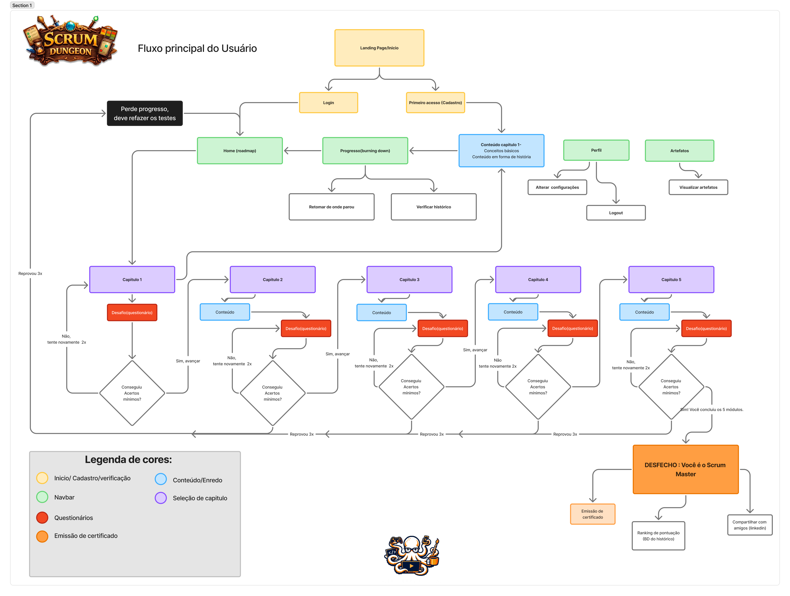

<div align="center">

<br>


<br>

<div align="center">


<div align="center">

> *"Aventureiro... os segredos do Scrum Master aguardam além desta porta.*
> *Você tem coragem de enfrentar a dungeon?"*
>
> — **O Corvo**

</div>


</div>

<br>

[](https://github.com/octopusCode26/ABP_DSM1_)
[](https://www.figma.com/design/96DMn9UVu2MT9xJIi5pBiQ/Prototipo_Scrum-Dungeon)
[]()

</div>

---

<div align="center">

### 🧭 Sumário

[Sobre o Projeto](#-sobre-o-projeto) · [Como Funciona](#-como-funciona) · [Tecnologias](#-tecnologias) · [Sprints](#-sprints) · [Como Executar](#-como-executar) · [Requisitos](#-requisitos) · [Os Aventureiros](#-os-aventureiros)

</div>

<span id="-sobre-o-projeto">

---

##  Sobre o Projeto

Scrum Dungeon é um RPG educativo desenvolvido como projeto integrador do 1º semestre do curso de **Desenvolvimento de Software Multiplataforma na FATEC Jacareí**, sob orientação do **Prof. Antonio Egydio São Thiago Graça** e com acompanhamento do **Prof. Marcelo Augusto Sudo**.

O projeto propõe uma **abordagem diferente** para o aprendizado de metodologias ágeis: em vez de memorizar conceitos isolados, o usuário os **vivencia** dentro de uma narrativa interativa. Cada mecânica do sistema foi pensada para refletir um aspecto real do Scrum — as regras do jogo são as regras do framework.

Desenvolvido em três sprints pelo grupo **Octopus Code**, o projeto aplica na prática a mesma metodologia que ensina.

---

<span id="-como-funciona">

##  Como Funciona

A dungeon é composta por 5 níveis progressivos, cada um abordando um conjunto de conceitos do Scrum. O jogador avança de sala em sala respondendo questões — e só conquista o próximo nível ao demonstrar que dominou o anterior.

```
ENTRADA
   │
   ▼
+----------+   +----------+   +----------+   +----------+   +----------+
|  NIVEL I |-->| NIVEL II |-->| NIVEL III|-->| NIVEL IV |-->|  NIVEL V |
|          |   |          |   |          |   |          |   |          |
|Fundamentos|  | Papéis e |   | Cerimôni-|   | Artefatos|   |  Ciclo   |
|  do Scrum|   |  Times   |   |    as    |   |  e Fluxo |   | Completo |
+----------+   +----------+   +----------+   +----------+   +----------+
                                                                  |
                                                                  v
                                                          [CERTIFICADO]
```

**Regras da dungeon:**

| Regra | Detalhe |
|-------|---------|
| Questões por nível | 10 sorteadas de um banco de 30 |
| Composição | 3 fáceis · 4 médias · 3 difíceis |
| Tentativas | Máximo de 2 por nível |
| Nota do nível | A maior entre as tentativas |
| Resultado final | Média das melhores notas |
| Recompensa | Certificado digital ao completar os 5 níveis |

---

<span id="-tecnologias">

##  Tecnologias

<div align="center">

</div>

<br>

O front-end é desenvolvido com **HTML, CSS e JavaScript puro**, sem o uso de frameworks ou bibliotecas de UI. O back-end utiliza **Node.js com Express** para gerenciar as rotas da aplicação, centralizando toda a lógica de negócio no servidor — cálculo de notas, controle de tentativas e emissão do certificado são processados exclusivamente no back-end. O banco de dados é **PostgreSQL**, manipulado com instruções DDL e DML escritas diretamente, sem o uso de ORMs. O versionamento adota **Git Flow adaptado**, com integração de código via Pull Request revisado. O design foi prototipado no **Figma**.

---

<span id="-sprints">

## 🕰️ Sprints

| Sprint | Período | O que será entregue | Status |
|--------|---------|---------------------|--------|
| **Sprint 1** | 13/04 — 30/04/2026 | Prototipação · Diagramas UML · Arquitetura · Nível 1 | 🔄 Em andamento |
| **Sprint 2** | 04/05 — 21/05/2026 | Cadastro · Login · Banco de questões · Sistema de avaliação | ⏳ Aguardando |
| **Sprint 3** | 25/05 — 11/06/2026 | Certificado · Histórico · Resultado final | ⏳ Aguardando |
| **Apresentação** | 22/06/2026 | Entrega e demonstração na FATEC Jacareí | ⏳ Aguardando |

<details>
<summary>📌 Sprint 1 — Backlog de tarefas</summary>
<br>

[](https://github.com/users/octopusCode26/projects/8)

| Tarefa | Responsável | Iniciada | Concluída |
|--------|-------------|:--------:|:---------:|
| Prototipação (Figma) | Renan, Enzo, Thiago, Vitor | ✔️ | — |
| Diagrama de Caso de Uso | Alef | ✔️ | ✔️ |
| Organizar Ambiente Virtual | Lorenzo | ✔️ | ✔️ |
| Definição de Conteúdo | Vitor | ✔️ | ✔️ |
| Organizar Arquitetura | Cauã, Igor, Lorenzo | ✔️ | ✔️ |
| Diagrama de Classe | Igor, Lorenzo | ✔️ | ✔️ |
| Nível 1 (Front-end) | Renan, Thiago, Cauã, Enzo | ✔️ | — |
| Diagramas de Sequência | Vitor, Lorenzo, Igor | ✔️ | ✔️ |

</details>

---

<span id="-como-executar">

##  Como Executar

> **Pré-requisitos:** Node.js e PostgreSQL instalados.

```bash
git clone https://github.com/octopusCode26/ABP_DSM1_.git
cd ABP_DSM1_
npm install
```

Crie um arquivo `.env` na raiz:

```env
DB_HOST=localhost
DB_PORT=5432
DB_USER=seu_usuario
DB_PASSWORD=sua_senha
DB_NAME=scrum_dungeon
```

```bash
npm start
```

> Instruções detalhadas de configuração do banco serão adicionadas ao longo das sprints.

---

<span id="-requisitos">

## 📜 Requisitos

<details>
<summary>Funcionais</summary>
<br>

| ID | Requisito |
|----|-----------|
| RF-1 | Cadastro com CPF, nome, e-mail e senha |
| RF-2 | Login por CPF e senha |
| RF-3 | Sorteio de 10 questões por nível (banco de 30) |
| RF-4 | Questões em três dificuldades: fácil, médio e difícil |
| RF-5 | Composição: 3 fáceis · 4 médias · 3 difíceis |
| RF-6 | Máximo de 2 tentativas por nível |
| RF-7 | Nota do nível = maior entre as tentativas |
| RF-8 | Resultado final = média das notas por nível |
| RF-9 | Certificado digital com nome, CPF, e-mail, data e notas |
| RF-10 | Histórico de tentativas com data, hora e pontuação |
| RF-11 | Consulta de progresso em tempo real |
| RF-12 | *(Opcional)* Área administrativa de questões |

</details>

<details>
<summary>Não funcionais</summary>
<br>

| ID | Requisito |
|----|-----------|
| RNF-1 | Interface simples, clara e responsiva |
| RNF-2 | Tempo de resposta adequado |
| RNF-3 | Conformidade com a LGPD |
| RNF-4 | Notas e tentativas não manipuláveis via front-end |
| RNF-5 | Backlog, sprints, versionamento e DoD documentados |
| RNF-6 | Documentação mínima: modelo de dados, rotas e instruções |

</details>

<details>
<summary>Restrições de Projeto</summary>
<br>

| ID | Restrição |
|----|-----------|
| RP-01 | O front-end deve ser desenvolvido exclusivamente com HTML, CSS e JavaScript puro — sem uso de frameworks ou bibliotecas de UI |
| RP-02 | O banco de dados é exclusivamente PostgreSQL, com DDL e DML explícitos — sem uso de ORMs |
| RP-03 | O sistema deve ser entregue e funcional dentro do prazo das 3 sprints definidas no cronograma |
| RP-04 | Toda a lógica de negócio (cálculo de notas, controle de tentativas) deve residir no back-end, nunca no front-end |
| RP-05 | O versionamento deve seguir o fluxo Git Flow adaptado, com contribuições via Pull Request aprovado |

</details>

<details>
<summary>User Flow</summary>
<br>

</details>

---

<span id="-os-aventureiros">

##  Os Aventureiros

<div align="center">


**`< OCTOPUS_CODE >;`**

<br>

<table>
  <tr>
    <td align="center">
      <a href="https://github.com/VtecturboBr">
        <br>
        <sub><b>Alef Oliveira</b></sub>
      </a><br><sub>Desenvolvedor</sub>
    </td>
    <td align="center">
      <a href="https://github.com/Cauaisq">
        <br>
        <sub><b>Cauã Silva</b></sub>
      </a><br><sub>Desenvolvedor</sub>
    </td>
    <td align="center">
      <a href="https://github.com/EnzoSuzukiProkopas">
        <br>
        <sub><b>Enzo Prokopas</b></sub>
      </a><br><sub>Desenvolvedor</sub>
    </td>
    <td align="center">
      <a href="https://github.com/igoriansen">
        <br>
        <sub><b>Igor Iansen</b></sub>
      </a><br><sub>Desenvolvedor</sub>
    </td>
  </tr>
  <tr>
    <td align="center">
      <a href="https://github.com/LorenzoOMN">
        <br>
        <sub><b>Lorenzo Nogueira</b></sub>
      </a><br><sub>Scrum Master</sub>
    </td>
    <td align="center">
      <a href="https://github.com/renanrmsantos14">
        <br>
        <sub><b>Renan Santos</b></sub>
      </a><br><sub>Desenvolvedor</sub>
    </td>
    <td align="center">
      <a href="https://github.com/thiagosantos-17">
        <br>
        <sub><b>Thiago Santos</b></sub>
      </a><br><sub>Desenvolvedor</sub>
    </td>
    <td align="center">
      <a href="https://github.com/vitorhirch">
        <br>
        <sub><b>Vitor Hirch</b></sub>
      </a><br><sub>Product Owner</sub>
    </td>
  </tr>
</table>

</div>

---

<div align="center">


<br>

*"A dungeon foi conquistada. Até a próxima jornada."*

`1DSM · FATEC Jacareí · 2026/1`

</div>
